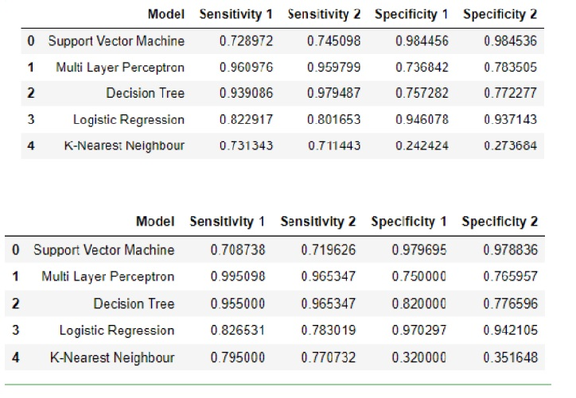

## Data Mining of Legacy Data

<h3> Description of the task. </h3>

- Introduction: Practical experience in handling a data-mining project using industry tooling for legacy data. The Data provided as part of this assessment is from the domain of cardio vascular medicine. The work herein requires the description and analysis of data for the given domain, including manipulation of data in various forms, as well as creation of classifiers

- Software: Python and Jupyter

- Methodology: CRISP-DM 

<h2>Methodology</h2>

<h3>Business Understanding</h3>
The first step to be undertaken in the project was business understanding of the data. The sample given was medical data with 11 columns. The first 10 columns would be used to predict the label value using a machine learning model. Looking at the data types of the data, Random and IPSI was a float64, Id was a int and the rest were objects. A model would be chosen and created to take a sample of this data and then predict the label of the test data.

<h3>Requirements</h3>

- Justify the reasons of the data preparation process and why I have done it this way.

- Take samples of the data attributes and find a link between them and patients being at risk

- Present my results and review my finings to critical analysis how my methodology was appropriate for this project.

- Provide a detailed analysis of the chosen models used in my project

<h3>Data Understanding</h3>
The dataset contains two attributes which are unique to the patients. But there is one attribute missing name Session. Six attributes in the dataset which are Boolean yes/no, two values (Nominal). Two more attributes which are percentage figure [0-100]. These fields satisfy the data required to be used in this process. But I noticed some problems with it, when looking at the data type Contra was labelled as an object. For Contra and IPSI these are inclusive integer ranges. Lastly, the label is either Risk or No risk. This will determine if a patient is at risk from the previous attributes in the dataset. In total there is 12 data field, but one is missing. Each field gives relevant information on the type of condition a patient may have.

Doing a cat plot of label with a hue of each data column, the data was visualized. The data showed that patients with diabetes were more likely to be at risk than those without. Those with diabetes and not at risk was very small. There was also a bar for unknown suggesting that the data had to be cleaned.
A visualization of IPSI using cat plot showed that those at risk generally had higher IPSI but were also distributed sparsely along lower values. Those not at risk had the highest count near the median.
Indication showed that it also had null or unknown values. ASX is split into two columns because each spelling of the entry is treated as a unique entry. This would have to be fixed in data preparation. The entries that had TIA were more likely to not be at risk than they were to be at risk.
In IHD those with IHD seem more likely to no be at risk. Whilst those that do have it have an almost even chance at being at risk or not being at risk. The same also seems to apply to Hypertension.
Patients that have Arrhythmia seem very likely to be at risk. History however seems to not matter that much.
BY doing a box plot of IPSI it is shown that IPSI has a small interquartile range between 73 and 85. The mean IPSI value is 78.8 with a standard deviation of 10.16.There lay a few outliers below the minimum.
Inspecting the data as a data frame and looking at the top 30 values and then identifying the number of unique values, Random appears to repeat as a value whereas ID does not. In the specification Session is mentioned as a variable however it is not present in the data whereas Random is not properly explained. A reasonable explanation for this would be that Random which has repeat values is the ID of the patient, with this value repeating as a patient has a second or third session. By inspecting the data it seems the same Random value generally repeats once and infrequently twice. The Id value however does not repeat which may be because this is the session identifier and would always be unique.

<h3>Data Cleaning</h3>
The data is checked for null values and quite a few appear. These are inspected individually for each category. Diabetes has 2 null values, Indication has 3, Hypertension has 3, History has 2, IPSI has 4, label has 4. Each set of null values has no correlation between them thus an explanation for why they are null such as certain entries being less likely to be entered are not applicable in this case. The values seem to be Missing Completely at Random (MCAR). MCAR means that a certain value being missing has nothing to do with its hypothetical value and with the values of other variables. Apart from IPSI the values missing are yes or no values. Imputing these values would rely on guesswork as there are no averages apart from mode to go on. Imputing the most common value into these spaces
600092 Data Mining and Decision Systems
would create a biased training data set and possibly incorrect results when using train test split so it is better to drop the rows of values as the dataset is quite large. Entries with IPSI missing are also being dropped to not introduce biases into the model as there is no easy way to predict the most accurate value of the missing values. These entries that have missing data likely occurred due to human error rather than the individual patient choosing to not disclose this information as the information was likely collected by a professional rather than done using a survey.
Contra has broken when trying to use it as a number value to display graphs, after inspecting it, it appears to be a object rather than a float or int so it will have to be converted to a float.
All the null values are dropped from the dataset correctly. After identifying a space in Contra for one of the entries it is replaced with a NaN and then also dropped.
Looking at the unique values of label there is a third value called Unknown. There is no description of what this value should be or any correlation between the entries that contain it so the entries containing this value are dropped. Contra values in the data frame are converted into float values.

<h3>Data Preparation</h3>
Now that the Contra value is fixed it can be visualized properly. Testing the data in a scatter plot against IPSI shows that it is working and also shows that those that have high values in both are labeled with risk. Having a low contra and high IPSI does not indicate that the patient is at risk with this data set. Contra has a very high interquartile range so it cannot be guessed what value would be the most appropriate to assign it the value 1 when fed in to a multi-layer perceptron. IPSI also cannot be easily assigned a 0 or 1 value.
To prepare the data for the multi-layer perceptron Random and Id are dropped. Even if they were renamed to ID and Session respectively due to the very low amount of repeat values in ID it is not apparent how they would be beneficial for the model being tested. Thus both values as well IPSI and Contra are being dropped and not used in this model. Label is dropped to add it to the end of the data frame to use as the y data. The data that the model is trying to predict. Indication was also dropped because it has to be split into four values using the get dummy method.
After dropping the relevant columns the data has the columns Diabetes, IHD, Hypertension, Arrhythmia and History and all the data in the data frame has the datatype object.
Using the magic command time it each value that is no in the data frame is replace with a 0 and using an else statement the remaining values become 1. As there are only yes or no values on the data frame this works well.
Indication is split using get dummy and is then merged to the data frame along with label.

### Model Selection

**Multi-Layer Perceptron**

Multilayer perceptron refers to a neural network with at least three layers of nodes, an input layer, some number of intermediate layers, and an output layer. Each node in a given layer is connected to every node in the adjacent layers.
A perceptron is meant to simulate a neuron in that it receives inputs like signals that are received by dendrites. Inputs are then processed, this is the cell processing the signals. A output is then created. The output is then received by the next neuron like a dendrite. These neurons are set up as a network. The input layer, hidden layer and the output layer. The hidden layer acts as a distillation layer that distills the patterns that are important from the inputs and sends it to the next layer.

<h3>Modelling</h3>
The data has to be split between what is being tested and what is being predicted. Thus the X value is assigned to the data of the first 10 columns and the last column, label, is assigned to y.
The original dataset should be split up into training and testing data. 70% of the data is to used for training and the remaining 30% will be used for testing the models ability to predict the label of the data. The data is split so that there is data for the model to be evaluated on to see how well the model performs on unseen data. Test data has to remain unseen by the model. A scaler is initialized to scale the data so it can easily be fed into the model. The data to be trained and the data to be tested is then scaled. MLP is imported and a class is initialized to set it up. Using fit the model is trained on the x train and y train values. Using predict the model uses the training data to predict the y values of the test data. Using metrics from sklearn classification report and confusion matrix is imported to get an understanding of the performance of the model. A confusion matrix also known as error matrix is a predictor of model performance on a classification problem.
After importing them a classification report is created and a confusion matrix. This outputs the results of the model as a confusion matrix and gives the precision, recall, f1-score and support of the values predicted. The precision is the ratio tp / (tp + fp) where tp is the number of true positives and fp the number of false positives. The precision is intuitively the ability of the classifier not to label as positive a sample that is negative. The recall is the ratio tp / (tp + fn) where tp is the number of true positives and fn the number of false negatives. The recall is intuitively the ability of the classifier to find all the positive samples. The F1 score can be interpreted as a weighted average of the precision and recall, where an F1 score reaches its best value at 1 and worst score at 0. The accuracy score of this initial model fluctuates around 0.88.

**Evaluation**
When preparing the data for the model the two columns for ASX were not dealt with properly as this is a clear problem which may affect the performance. Testing different iterations for the value showed that 1000 iterations is the optimum amount as any higher or lower reduce the accuracy.

**Data Understanding**
Asx and Asx have been entered as separate and unique values and this was likely a human error so the two columns combining would have a positive effect on the data.

**Data Preparation**
After creating a dummy of indication another column is created called ASX that add the two ASX variables together and then merges with the rest of the data frame after removing the redundant columns. The column is tested using value counts to not have lost any values in the transition.

**Modelling**
A new multi-layer perceptron is created after X value uses the combined values of ASX now. Running the model on the data again the model outputs an accuracy result of around 0.92. The model is teste for the best number of layers.

**Evaluation**
The accuracy of the data has improved slightly. The best layers are 10, 10,10 for the model. The model needs to be tested for the optimum test size.

**Modelling**
Creating a new multi-layer perceptron and varying the test size and running through it a suitable test size of 0.2 is established improving the accuracy slightly to fluctuating around 0.93. A heat map is created to better visualize the confusion matrix.

**Evaluation**
Better metrics than just accuracy need to be attached to each model.

**Modelling**
Sensitivity is how good a test is at detecting the positives. A model can cheat this by always returning positive.
Specificity is how good a test is at avoiding false positives.
Using both these metrics will help get a better understanding of the performance of the model. A matrix is created to assign the values of specificity and sensitivity to store later for the evaluation against other models

### Model Selection

**K-Nearest Neighbor Classifier**
KNN is a simple classification algorithm and a commonly used learning algorithm. It is a non-parametric lazy learning algorithm. The purpose of it is to predict the classification of a new sample point using data separated into classes. KNN does not make any assumptions on the underlying data distribution. This model is effective when there is no prior knowledge of the distribution of the data. KNN does use the training points to do any kind of generalization. The training phase is minimal.

**Modelling**
After importing and running this model the accuracy is very low fluctuating around 0.6 meaning this model may not be suitable for this data set or it needs to be larger.
Its sensitivity is sometimes very low at 0.3.

**Decision Tree**
The advantage to using decision trees are they are easy to interpret. It is a white box model which closely mimics the human decision-making process. It can work with numerical and categorical data. Feature selection also happens automatically which means that unimportant features will not influence the result. However as a model it tends to over fit which can be limited by limiting tree depth.

**Modelling**
The data is split and trained by the model and predictions are made. A decision tree is plotted to visualize the white box method. The accuracy of the model fluctuates around 0.9 with a sensitivity of 0.7 and specificity of 0.96. The very high specificity of this model makes it very good for not shooting of false alarms.

**Logistic Regression**
Logisitic regression uses the sigmoid function:
g(z) = 1/( 1 + e ^−z)
Logistic Regression is used for prediction of output which is binary.
Logistic regression is used to predict the probability of a categorical dependent variable
Unlike linear regression, logistic regression can directly predict probabilities (values that are restricted to the (0,1) interval).
This model works better than a decision tree model if the signal to noise ratio is low. If the AUC is below 0.8 Logistic regression should outperform decision trees.

**Modelling**
The logistic regression performs similarly to decision trees in regards to accuracy but has a much high specificity of 0.82 and sensitivity of 0.97.

## Support Vector Machine

Support Vector Machine” is a supervised machine learning algorithm which can be used for both classification or regression challenges. In the algorithm each data item is plotted as a point in n-dimensional space (where n is number of features you have) with the value of each feature being the value of a particular coordinate. Classification is done to fine a hyper-plane which differentiates the data distinctly.

**Modelling**
SVM also give a high accuracy after running it of around 0.9 with a low sensitivity of 0.66 and a specificity of 0.97

**Evaluation**
The models are performing well except KNN which performing very poorly possibly because it is not suited for this problem. The existing data does not include Contra or IPSI so the models do not currently use that data. Adding this data may make the models perform better. This has to be handled carefully however as the models will input this data as a 0 or a 1 value thus the two columns need to be evaluated for the best number to use to split them as just using the median or mean may detract from the performance of the models using the data.

**Data Understanding**
IPSI has a very small interquartile range meaning the data is very close together with a few outliers so every value matters when splitting the data into 1 and 0. Values labeled risk tend to be on certain levels with gaps of no risk in-between. IPSI has a standard deviation of 10.

**Modelling**
IPSI is extracted from the data frame as a list and then iterated through changing the value to a 1 or 0 based on the equals or greater than boundary. As the original data frame is being used label has to be converted to 1 and 0 as well. After this process it is converted back into a data frame trained on a decision tree with a test size split of 0.25. The risk based on IPSI alone decision tree is highest at the value of 90 however at that level the sensitivity is 0 meaning the model was simply predicting everything as negative and being write because of how the data was split. The best value is the one with the highest sensitivity and specificity which using this model is 79. 79 is assigned as the value that will split as it split the data to return good predictions the best.
K-fold cross validation was used on the IPSI value to find at which split does it return the highest accuracy as using k-fold split gives good averages for data. The accuracy only has a significant increase above 90 and is at an accuracy of 0.77 at the value of 79 so this was chosen as the optimum value.
Now the data with IPSI added values are fed into the multi-layer perceptron to test if this impacts the model negatively.

**Evaluation**
Adding IPSI by itself improves or makes no impact on the model, it does not make the model worse so on average it is an improvement. Now contra needs to be tested accordingly. With an accuracy of 0.93 and sensitivity of 0.79 it has had a positive effect.

**Data Understanding**
Contra has a large inter-quartile range unlike IPSI so the split point may have to be more in the middle that in the upper quartile of the data sample.

**Modelling**
Contra is extracted from the data frame and converted into a list and then iterated through changing the value based on the value splitter. . After running a decision tree model on the Contra input Accuracy is (>= 40) at 0.665188 / (>= 50) at 0.700665 / (>= 60) at 0.758314 / (>= 70) at 0.815964 / (>= 80) at 0.831485 / (>= 90) at 0.844789

Sensitivity at various levels: 30 = 0 , 40 = 0 , 50 = 0.954 , 60 = 0.81 , 70 = 0.726 , 80 = 0.629 , 90 = 0.55.
Due to sensitivity being the highest at 50 the split should be at 50 but taking into account specificity the best value is 70 so that is the value used as it also has a high accuracy at that value.
K-fold is used to test the usefulness of each value. the accuracy is highest at 90 however this has bad sensitivity. The performance of 0.70 is not much lower than 0.90 and is the same as 0.80 so it is the most suitable cut off point for Contra.

**Evaluating**
Using the new Contra and IPSI values added to the data frames the old models need to be run with new data to test this.

**Modelling**
Each model is tested with the new data and metrics are taken and assigned to a data frame for better comparison with the first result being without contra and IPSI added to the data samples.

<h3>Deployment</h3>
In this stage, I want to take the evaluation results and use this to determine a strategy for deployment. The relevant models have been created and are ready for deployment. For this to be a success it has to be approved and meet the project requirement for it to be a success. This deployment plan is summarised and uses deployment strategy which
will include the steps on how to perform it in real life.

# Results

## Evaluation & Discussion

I did not take accuracy into the evaluation as specificity and sensitivity are more important metrics to determine the performance of the deployed model in this field.
For the multi-layer perceptron adding Contra and IPSI has improved its specificity. Over all it can be said the second data set for MLP is an improvement thus the new values were useful to it.
KNN seems to suffer in performance in the second data sets performing better when it does not have Contra and IPSI to deal with.
Decision Tree model is not really affected by the second data set that much fluctuating regularly.
The second dataset clearly shows an improvement in performance of SVM.
Logistic regression however suffered from the additional data , clearly performing worse with the second data set.
The models could have benefited from focus on a smaller amount and fine tuning them to optimize them better rather than testing out many models and comparing which one is the best to use.
ROC Curve is used to plot the true positive rate against the false-positive rate. It shows sensitivity and specificity. In the results, I have plotted false positive rate as X and true positives as y and these values are between 0.0 and 1.0. This graph predicts my binary outcome. ROC is used to evaluate model performance. The graph represents a high specificity. A high rate of specificity means a high value of true negative and lower false positive. This graph has a high level of specificity which means a proportion of people do not suffer from the disease who got predicted correctly. 

Overall the best performing model is one that can use all the data which includes the Contra and IPSI values and doesn’t suffer from using it. That would be MLP as its specificity increases reducing its likelihood of reporting a false positive as that is important in the medical section as false alarms would cost a lot of money to test for and put pressure on health care services. Its sensitivity is also very high and improves with the second data set. The second best would be support vector machine as the performance increases with the additional data set and it has a very high specificity reducing false alarms but its sensitivity is low meaning it is not good at detecting risk compared to MLP thus MLP is the best model to use for this problem. 

At each stage of the methodology, I felt like I followed the processes and kept referring back to it to make sure I wasn’t going wrong. Reflecting on it there are a couple of improvements I would have made. The first would have been understanding the data more. This would have been looking more into the raw data to find any trends and patterns in the data frame. Another would be to create more visualization on the data frame and explore the different columns against each other to find a correlation. In Data preparation, instead of dropping the data I would have calculated the mean of the column and repair the Null values with fillna(). This would have worked better as dropping rows can affect the whole dataset. 

Thank you for reading. Contact me at **Email:harry.akuoko@gmail.com** for any questions.
